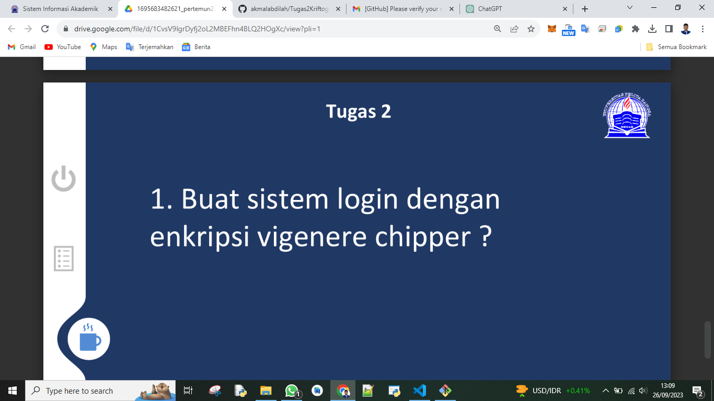
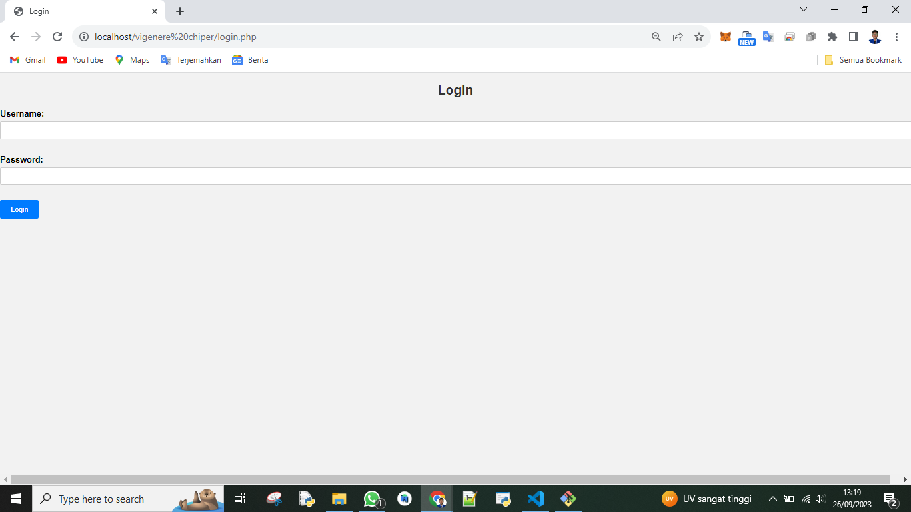
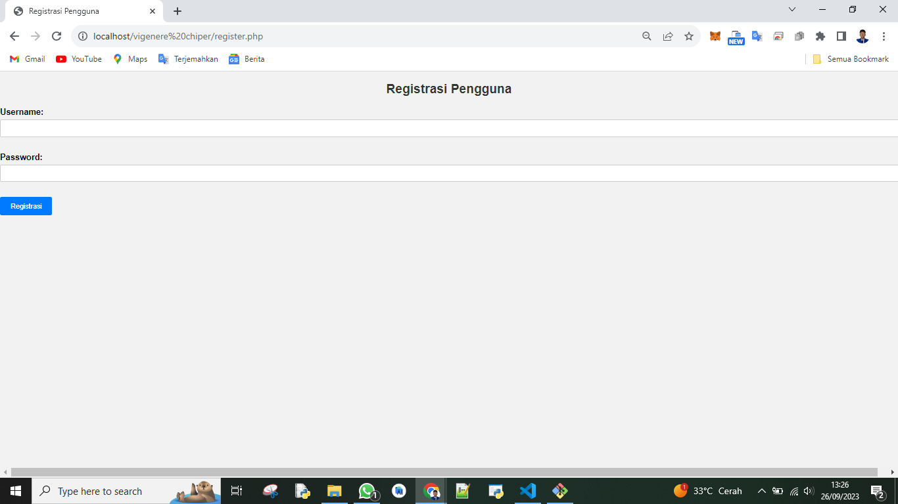
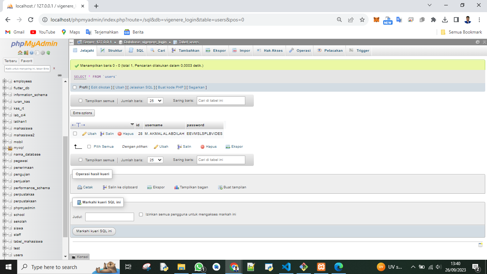

# Kriptografi Pertemuan 2



## Profil
| #               | Biodata                      |
| --------------- | ---------------------------- |
| **Nama**        | M. AKMAL AL ABDILAH          |
| **NIM**         | 312110034                    |
| **Kelas**       | TI.21.A.1                    |
| **Mata Kuliah** | Kriptografi                  |


<p align="center">
 
</p>
<p align="center">
<a href="https://github.com/akmalabdilah"></a>
<p align="center">

<hr>

## Kriptografi membuat sistem login dengan enkripsi vigenere chipper yang terkoneksi ke database

<hr>

<p>
Disini saya akan menjelaskan secara singkat apa itu Kriptografi sistem login dengan enkripsi vigenere chipper yang terkoneksi ke database.

Sistem login dengan enkripsi Vigenere Cipher adalah sebuah mekanisme keamanan yang digunakan untuk mengamankan proses login ke suatu sistem atau aplikasi. Pada sistem ini, teks password yang dimasukkan oleh pengguna dienkripsi menggunakan metode Vigenere Cipher sebelum dikirim ke database untuk verifikasi. Berikut adalah penjelasan singkatnya:

1. Enkripsi Vigenere Cipher: Pengguna memasukkan password mereka, dan password tersebut dienkripsi menggunakan algoritma Vigenere Cipher sebelum dikirim ke server atau database. Vigenere Cipher adalah metode enkripsi kunci simetris yang menggabungkan teks asli dengan kunci rahasia untuk menghasilkan teks terenkripsi.

2. Kunci Rahasia: Setiap pengguna memiliki kunci rahasia yang berbeda untuk mengenkripsi dan mendekripsi password mereka. Kunci ini biasanya unik untuk setiap pengguna dan harus disimpan secara aman.

3. Penyimpanan Teks Terenkripsi: Password yang telah dienkripsi dengan Vigenere Cipher disimpan di dalam database, bukan teks asli. Ini berarti bahwa teks password yang sebenarnya tidak disimpan dalam bentuknya yang sebenarnya di database.

4. Verifikasi: Ketika seorang pengguna mencoba masuk, sistem akan mengambil password yang dimasukkan, mengenkripsinya dengan kunci yang sesuai, dan membandingkan hasil enkripsi dengan data yang ada di database. Jika cocok, pengguna diizinkan untuk masuk.

Keuntungan dari sistem ini adalah bahwa password disimpan dalam bentuk terenkripsi, sehingga bahaya pencurian data password dalam teks asli dapat diminimalkan. Namun, penting untuk menjaga keamanan kunci rahasia dan implementasi Vigenere Cipher dengan baik untuk menghindari potensi kerentanan keamanan.
</p>


<hr>


## Kriptografi membuat sistem login dengan enkripsi vigenere chipper yang terkoneksi ke database menggunakan pemograman php yang di simulasikan di web

 

<hr>

<p>
Oke tampa basa basi lagi saya akan jelasakan program yang saya kerjakan untuk memenuhi tugas kriptografi pertemuan 2
</p>

<p>
1. Tampilan menu login
</p>



<p>
Seperti yang di tampilkan gambar di atas menu login ini adalah tempat kita untuk memasukan user name dan password yang sudah di buat di menu registrasi, dan berikut scrip kodenya ada di bawah ini.
</p>

login.php

```php
<!DOCTYPE html>
<html>
<head>
    <title>Login</title>
    <link rel="stylesheet" type="text/css" href="style.css">
</head>
<body>
    <h2>Login</h2>
    <form method="post" action="process_login.php">
        <label for="username">Username:</label>
        <input type="text" name="username" required><br><br>
        <label for="password">Password:</label>
        <input type="password" name="password" required><br><br>
        <input type="submit" value="Login">
    </form>
</body>
</html>
```

process_login.php

```php
<?php
// Fungsi untuk mengenkripsi teks menggunakan Vigenere Cipher
function vigenereEncrypt($text, $key) {
    $text = strtoupper($text);
    $key = strtoupper($key);
    $result = "";
    $keyLength = strlen($key);
    $keyIndex = 0;

    for ($i = 0; $i < strlen($text); $i++) {
        $char = $text[$i];
        if (ctype_alpha($char)) {
            $textChar = ord($char) - 65;
            $keyChar = ord($key[$keyIndex % $keyLength]) - 65;
            $encryptedChar = ($textChar + $keyChar) % 26 + 65;
            $result .= chr($encryptedChar);
            $keyIndex++;
        } else {
            $result .= $char;
        }
    }

    return $result;
}

// Konfigurasi database
$servername = "localhost";
$username = "root";
$password = "";
$database = "vigenere_login";

// Membuat koneksi ke database
$conn = new mysqli($servername, $username, $password, $database);

// Periksa koneksi database
if ($conn->connect_error) {
    die("Koneksi database gagal: " . $conn->connect_error);
}

if ($_SERVER["REQUEST_METHOD"] == "POST") {
    $username = $_POST["username"];
    $password = vigenereEncrypt($_POST["password"], "selasa"); // Ubah menjadi kunci yang sama saat pendaftaran

    $sql = "SELECT * FROM users WHERE username = ? AND password = ?";
    $stmt = $conn->prepare($sql);
    $stmt->bind_param("ss", $username, $password);
    $stmt->execute();
    $result = $stmt->get_result();
    $stmt->close();

    if ($result->num_rows === 1) {
        echo "Login berhasil!";
        // Lakukan tindakan yang sesuai setelah login berhasil
    } else {
        echo "Login gagal. Silakan coba lagi.";
    }
}

// Menutup koneksi
$conn->close();
?>
```

<p>
2. Tampilan menu registrasi yang akan otomatis mengkrip password menggunakan vigenere chiper.
</p>



<p>
Seperti menu login menu register adalah menu untuk kita mendaftarkan username dan juga password bedanya kita masi bisa memasukan username dan password, yang kita mau sedangkan menu login tidak bisa jika kita memasukan username dan password yang tidak terdaftar di database maka otomatis kita akan di arahkan ke luar atau ada bacaan erro, kalian bisa mencoba kode di bawah ini.
</p>


register.php

```php
<?php
// Import koneksi database
include('koneksi.php');

if ($_SERVER["REQUEST_METHOD"] == "POST") {
    $username = $_POST["username"];
    $password = $_POST["password"];

    // Enkripsi kata sandi dengan Vigenere Cipher (Anda harus mengganti ini dengan algoritma enkripsi yang lebih aman)
    $encrypted_password = vigenere_encrypt($password, "selasa");

    // Simpan data pengguna ke dalam database
    $sql = "INSERT INTO users (username, password) VALUES ('$username', '$encrypted_password')";

    if ($conn->query($sql) === TRUE) {
        echo "Registrasi berhasil.";
    } else {
        echo "Error: " . $sql . "<br>" . $conn->error;
    }
}
function vigenere_encrypt($text, $key) {
    $text = strtoupper($text); // Ubah teks ke huruf kapital
    $key = strtoupper($key);   // Ubah kunci ke huruf kapital
    $encrypted_text = '';

    $text_length = strlen($text);
    $key_length = strlen($key);

    for ($i = 0; $i < $text_length; $i++) {
        $text_char = ord($text[$i]);
        $key_char = ord($key[$i % $key_length]);

        if (ctype_alpha($text[$i])) {
            // Enkripsi hanya dilakukan untuk huruf alfabet
            $encrypted_char = chr(((($text_char - 65) + ($key_char - 65)) % 26) + 65);
            $encrypted_text .= $encrypted_char;
        } else {
            // Tidak perlu mengenkripsi karakter selain huruf alfabet
            $encrypted_text .= $text[$i];
        }
    }

    return $encrypted_text;
}

?>
<!-- HTML form untuk registrasi -->

<!DOCTYPE html>
<html>
<head>
    <title>Registrasi Pengguna</title>
    <link rel="stylesheet" type="text/css" href="style.css">
</head>
<body>
    <h2>Registrasi Pengguna</h2>
    <form method="post" action="<?php echo $_SERVER["PHP_SELF"]; ?>">
        <label for="username">Username:</label>
        <input type="text" name="username" required><br><br>
        <label for="password">Password:</label>
        <input type="password" name="password" required><br><br>
        <input type="submit" value="Registrasi">
    </form>
</body>
</html>
```


<p>
3. Tampilan database yang sudah di ekrip menggunakan vigenere chiper.
</p>



<p>
Seperti gambar di atas setiap kita registrasi di menu registrasi kita data kita akan di proses dan akan di ekrip terutama password menggunakan vigenere chiper dan kalian bisa mencoba scrip database di bawah ini.
</p>


vigenere.sql

```php
-- phpMyAdmin SQL Dump
-- version 5.2.0
-- https://www.phpmyadmin.net/
--
-- Host: 127.0.0.1
-- Waktu pembuatan: 26 Sep 2023 pada 08.34
-- Versi server: 10.4.24-MariaDB
-- Versi PHP: 7.4.29

SET SQL_MODE = "NO_AUTO_VALUE_ON_ZERO";
START TRANSACTION;
SET time_zone = "+00:00";


/*!40101 SET @OLD_CHARACTER_SET_CLIENT=@@CHARACTER_SET_CLIENT */;
/*!40101 SET @OLD_CHARACTER_SET_RESULTS=@@CHARACTER_SET_RESULTS */;
/*!40101 SET @OLD_COLLATION_CONNECTION=@@COLLATION_CONNECTION */;
/*!40101 SET NAMES utf8mb4 */;

--
-- Database: `vigenere_login`
--

-- --------------------------------------------------------

--
-- Struktur dari tabel `users`
--

CREATE TABLE `users` (
  `id` int(11) NOT NULL,
  `username` varchar(50) NOT NULL,
  `password` varchar(255) NOT NULL
) ENGINE=InnoDB DEFAULT CHARSET=utf8mb4;

--
-- Dumping data untuk tabel `users`
--

INSERT INTO `users` (`id`, `username`, `password`) VALUES
(19, 'root', 'SOXAD'),
(20, 'root', 'KEZCT'),
(21, 'root', 'UIYK'),
(22, 'root', 'CYYAFG'),
(23, 'lui', 'DYT'),
(24, 'root', 'MHT'),
(25, 'lui', 'DYT'),
(26, 'AKMAL', 'SOXAD'),
(27, 'koli', 'CSWI');

--
-- Indexes for dumped tables
--

--
-- Indeks untuk tabel `users`
--
ALTER TABLE `users`
  ADD PRIMARY KEY (`id`);

--
-- AUTO_INCREMENT untuk tabel yang dibuang
--

--
-- AUTO_INCREMENT untuk tabel `users`
--
ALTER TABLE `users`
  MODIFY `id` int(11) NOT NULL AUTO_INCREMENT, AUTO_INCREMENT=28;
COMMIT;

/*!40101 SET CHARACTER_SET_CLIENT=@OLD_CHARACTER_SET_CLIENT */;
/*!40101 SET CHARACTER_SET_RESULTS=@OLD_CHARACTER_SET_RESULTS */;
/*!40101 SET COLLATION_CONNECTION=@OLD_COLLATION_CONNECTION */;

```


<P>
Oke sekian penjelasan singkat saya mengenai tugas kriptografi kali ini jika kalian masih penasara kalian bisa mencoba file lengkap vigenere chiper code yang ada di atas kurang lebih saya mohon maaf.
</P>

<p>
 sekian and selesai.
</p>

<div>
<h2 align="center">Thanks For Reading!!!</h2>
<div align="center">
